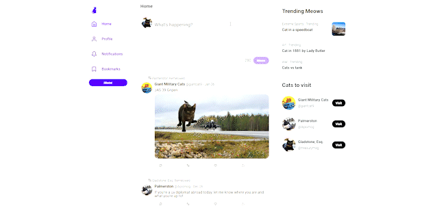

# Critter | 🐦 Twitter Clone

## Demo

## Description

A Twitter-like social media platform for posting, liking, and following users. Experience the familiar features of Twitter in this engaging project.

## Problems

- Build a user-friendly and engaging UI similar to Twitter's in a short timeframe of only 4 days.
- Integrate the frontend with a pre-existing backend API, ensuring seamless communication and data flow between the two.
- Implement robust error handling and messaging to ensure that users receive clear and helpful feedback when issues arise.

## Solutions

- Built the frontend using a pre-made template, while still customizing it to fit project requirements and ensuring a visually appealing design.
- Implemented additional features such as a trending section, user profile tooltips, dynamic follow button, and following page, to enhance the user experience. 
- Ensured the website was responsive, including designing and implementing responsive sidebars, to optimize the user experience on all devices.

## Challenges

- Implementing error handling for the backend API response and displaying user-friendly error messages was a significant challenge. I had to utilize the userContext and pass error messages through components to achieve this.
- Creating a seamless user experience was crucial, which meant implementing data fetching without page refreshes. I achieved this using React's useEffect hook and async/await functions.

## Project Details

- Development time: Completed in 4 days
- Front-end: Built with React.js, JavaScript, and Styled Components
- Back-end: Utilizes a Node.js and Express API
- Tools: Git and GitHub 

## Conclusion
In conclusion, this Twitter-like social media project presented several challenges that required creative solutions, such as implementing a userContext to display error messages and creating a user profile tooltips. 

Despite the tight deadline of 4 days, I was able to build a responsive and engaging platform, complete with trending meows, profile tooltips, and other bonus features. This project was built using React.js, JavaScript, and Styled-components. Overall, this project showcases my abilities as a web developer and my commitment to creating user-friendly and visually appealing web applications.