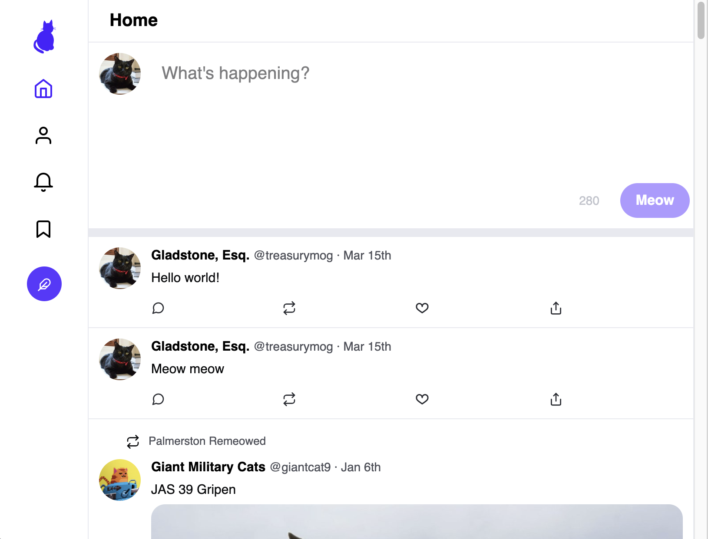
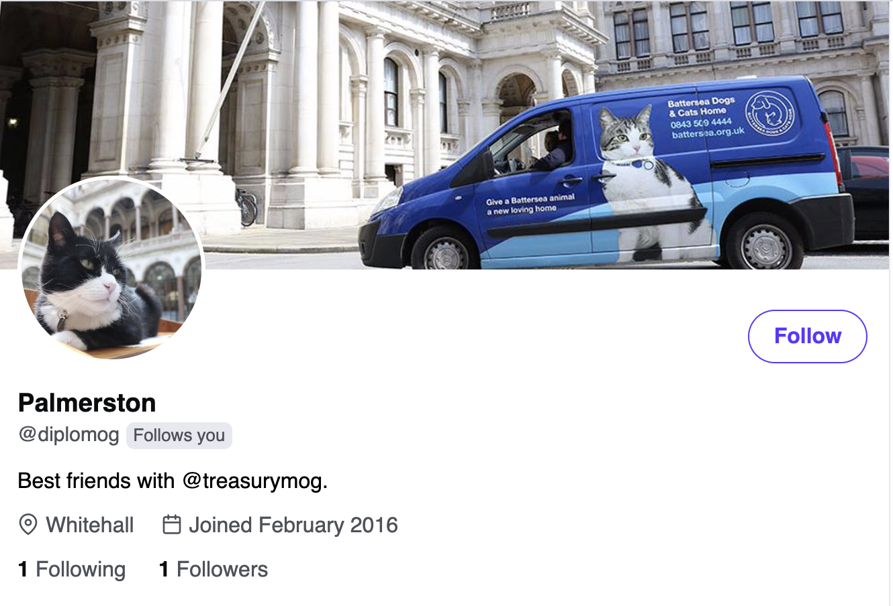
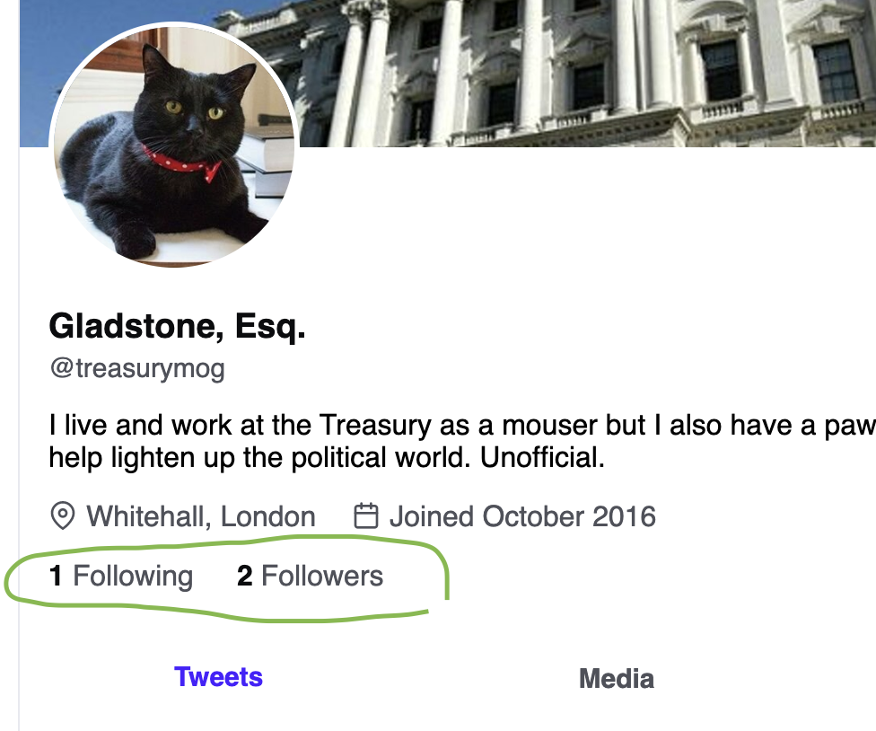

# Stretch Goals

> NOTE: This is a **large project**. Even the non-stretch goals are a lot to get done in the available time! If you're peeking ahead and worried you won't get to these, please don't worry.

## 1. Keyboard navigation

Keyboard navigation is a must for accessability! Make sure your website can navigated with the use of a keyboard too.

> **HINT**: You'll want to use the `tabIndex="0"` property to get started.

## 2. Profile tooltips

When hovering over a user's display name, a tooltip should reveal more information about the person:

You can use Tippy.js/react for this! Bonus points for adding a subtle delay before showing/hiding, to prevent unwanted opening/closing.

## 3. Responsive design

On smaller windows, the sidebar should collapse into icons:

Bonus points for testing on a real mobile device, and ensuring everything still works!

## 4. Following

The API is fully set up to support following and unfollowing users. Let's take advantage of it!

First, let's update the Profile to include two things (if you haven't already):

- A "Follow" button, when viewing a profile other than the current user's (treasurymog).
- A grey "Follows you" tag when the profile in question follows the current user

Clicking the "Follow" button should change the button to a filled-in state, and the text should become "Following". In addition, the user's # of followers should increment by 1.

When you navigate to the home feed, you should now see the tweets of the user you've followed (or no longer see the tweets for a user you unfollowed).

_NOTE:_ The API's endpoints for following/unfollowing don't work the same way as the like/unlike and retweet/unretweet endpoints. Be sure to consult with the documentation!

Finally, you should convert the # of followers/following into links, on the user profile:

Clicking them should take the user to a new route, which will display a list of users.

There is no design for this, but we can take inspiration from the real Twitter website:

